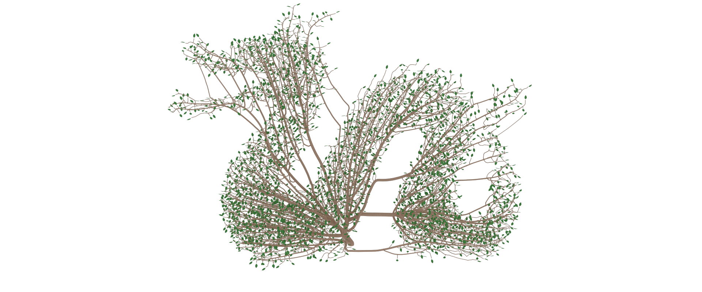
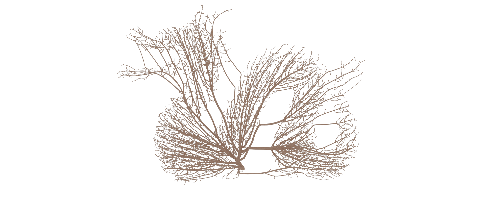
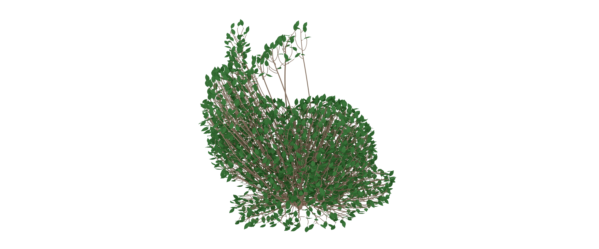
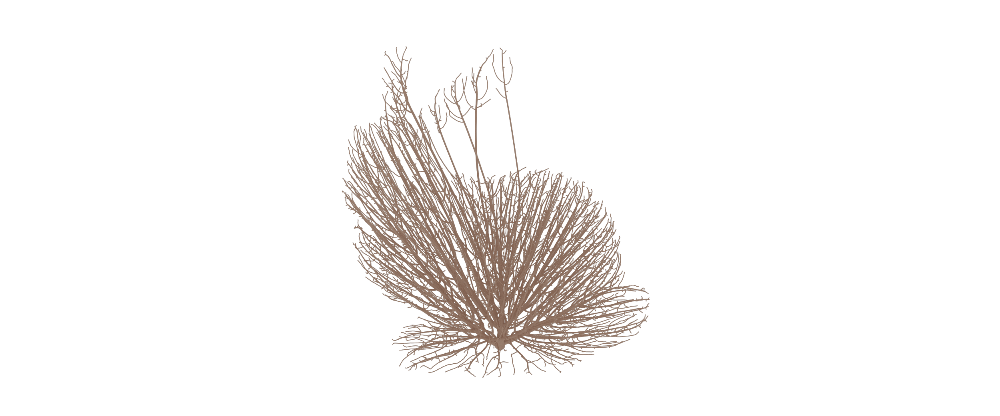
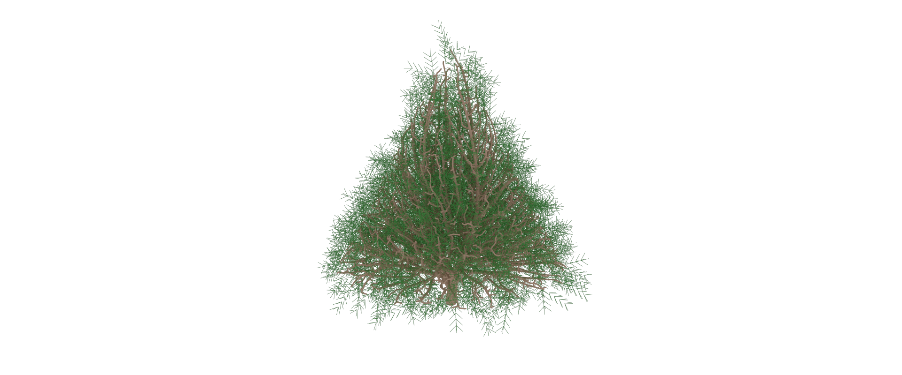
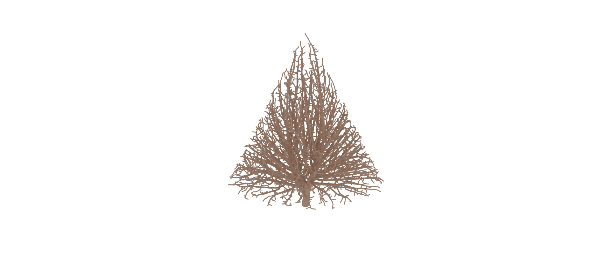

# Tree Mesh generation via Space Colonization Algorithm
Grows a tree (or a bush) towards a set of points, which can be sampled in any shape.  
Many types of tree can be generated this way in matters of minutes.  
Supports leaves, which can be added at the end of branches.  

## Examples
 
 
  
  
